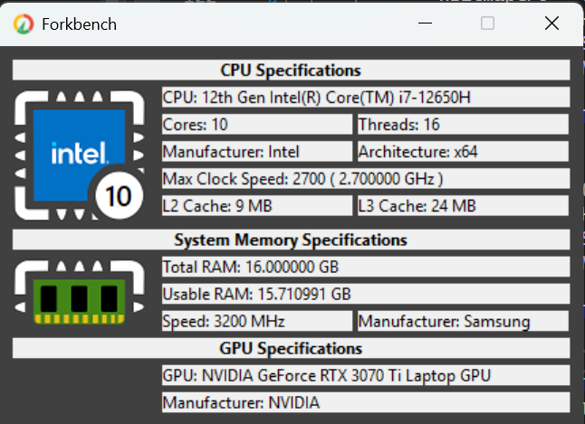

# ForkBench

System Information and Benchmark Tool for Windows 
## Features: 
1. System information fetching.
    CPU:
 Manufacturer, CPU Name, Codename, Release Date, Max. TDP, Technology, Model, Instruction Set, Max. Core Speed, Cores and Thread, Power and Energy efficient cores, Core Voltage, Current Core Speeds, Cache sizes, Motherboard Info, BIOS 
 information, RAM total size, page file, RAM Memory speed, DRAM Type, Channels
 GPU: GPU Name, Manufacturer, Release date, Max TDP, VRAM Size, Speed and Type, Base and Boost core clock, GPU Code, CUDA Cores, ROPs/TMUs, Texture fillrate, Pixel fillrate, Bus width, bandwidth, driver version, Support: Direct compute, 
 physx OpenGL, Vulkan, DirectX, Raytracing, DirectML
 Windows: Edition, Version and Build, Directx version, Device name, System type
 Storage: SSD/HDD Size and Speed

2. Realtime Computer Metrics
 
      CPU: Temperatures, Core Utilizations, Voltages
  
      GPU: Temperatures, Core Utilizations, Voltages

3. Benchmarking
 
      ForkGPU Score, ForkCPU Score, ForkDisk Score and ForkRAM Score would be scores giving to each hardware on the basic of their performance.
      ForkScore would be the overall total score for the whole system.

## Development Phases

Phase 1: 
 - Development of a console application that will be the backbone of the information fetching and organising and also the crux of all the benchmarking that i'll do on the project
 - Design of the UI and also an App Logo 

Phase 2: 
 - Development of the User Interface for the information collected

Phase 3: 
 - Further Enhancements and future developments

Phase 1: Screengrab
- 6th June 2025

- 7th June 2025

- 8th June 2025

